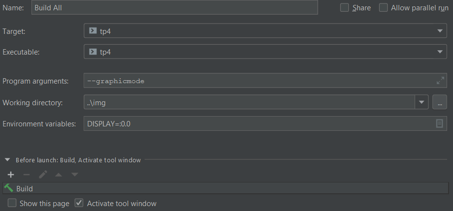

# Ataxx
Ataxx est un jeu développé à la base par Ataari. Cette version remasterisée reprend les mêmes règles de jeu mais avec des graphismes renouvelés.

# Description
Dans cette nouvelle version, chacun joue à son tour et tente d'éliminer tous les pions adverses à l'aide de deux types de déplacement: Ajout d'un pion
à une seule case du pion initiale, Déplacement du pion initiale à deux cases de sa position d'origine.

# Visual
Nous y avons crée une ambiance assez mystérieuse mais détendu, cela semblait correspondre avec l'image qu'on se fait d'un jeu de stratégie.

# Usage
Pour jouer à cette version d'Ataxx, je vous recommande vivement de le lancer sous CLion de JetBrain avec les configurations suivantes:

Pour y accéder: Run/Edit Configurations
Il faut savoir qu'une version graphique et terminal ont été réalisés. Celle-ci peuvent être jouée indépendamment grâce à l'argument "--graphicmode" ou "--terminalmode" (respectivement la version graphique et version terminal) qui peuvent être modifié comme sur l'image précédente.
Le nom de l'exécutable est "tp4". De plus, pour une meilleure expérience de jeu, évitez de redimmensionner les fenêtres.

# Support
Si vous avez besoin d'une quelconque information ou aide, n'hésitez pas à me contacter à l'adresse suivante: quentin.hanry@isen-ouest.yncrea.fr.
